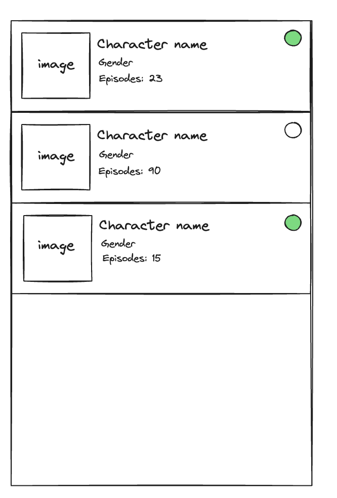

# Getting Started

[React Native - Project Setup](RN_README.ms)

# ManoMano Mobile Tech Project

🚀📱 Welcome, Mobile Engineer, to the interdimensional coding adventure! Today, we embark on a quest to bring the chaotic brilliance of Rick and Morty into the palm of your hand. Imagine a world where your app isn't just an app—it's a portal to the multiverse of tech brilliance!

### Phase 1: List Rick & Morty characters

Your mission is to construct a listing view that can handle the sheer magnitude of Rick and Morty's characters.

You have to finish the **_ListingScreen.tsx_** implementation with the paginated listing view in order to show the list of characters you have to consume from this endpoint:

https://rickandmortyapi.com/documentation/#rest

Also you have some helpers functions already prepared to fetch the information from the server in the **_app/services/api.ts_** folder

```
app/services/api.ts
```

##### To do:



1. Create item component for the list item where you will render the character information, similar to the represented components of the previous image example. The design shouldn't be necessary the same, focus to deliver a functional app.
   - Display the thumbnail image of the character.
   - Display name, gender and the amount of episodes where the character appeared.
   - Indicator to know the character status: 'alive', 'dead' or 'unknown'.
     - Green: alive
     - Red: Dead
     - Grey: Unkown
2. Render list of characters using item component you created.

- Fetch character data from server using api function provided.
- Keep character data as a state and handle pagination and following incoming data when scrolling the list.

4. Handle loading states.

### Phase 2: Add a new screen to the app

1. Add a new screen to the navigation of the app. We created for you already a component **_DetailScreen.tsx_**.
2. When pressing a list item, navigate to this new screen.
3. In this new screen we want to render the data of the selected item.

### Bonus: Add tabs in the new screen

We want to create a bottom tabbed view for the details screen in order to see in the first tab the basic details
of the character and in the second tab the list of episodes where the character appeared.

- No need to build any UI for this screen you can simply render in JSON format the data in the screen.
